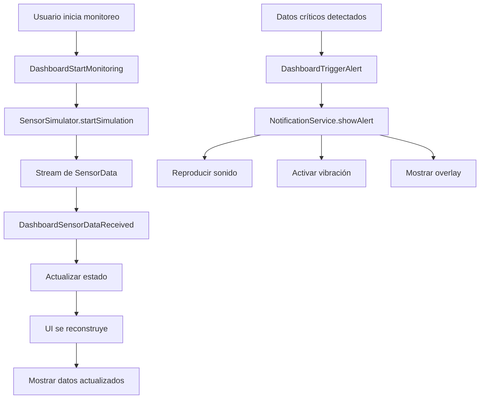

# DriveGuard - Documentación de Arquitectura y Componentes

## Tabla de Contenidos
1. [Visión General](#visión-general)
2. [Arquitectura del Proyecto](#arquitectura-del-proyecto)
3. [Estructura de Directorios](#estructura-de-directorios)
4. [Componentes Core](#componentes-core)
5. [Capa de Dominio](#capa-de-dominio)
6. [Capa de Datos](#capa-de-datos)
7. [Capa de Presentación](#capa-de-presentación)
8. [Widgets Personalizados](#widgets-personalizados)
9. [Servicios y Utilidades](#servicios-y-utilidades)
10. [Gestión de Estado](#gestión-de-estado)
11. [Configuración y Constantes](#configuración-y-constantes)
12. [Flujo de Datos](#flujo-de-datos)
13. [Principios Aplicados](#principios-aplicados)

---

## Visión General

DriveGuard es un **Sistema de Monitoreo Inteligente de Conducción** desarrollado en Flutter que utiliza Clean Architecture y el patrón BLoC para la gestión de estado. El sistema simula el monitoreo en tiempo real de sensores vehiculares para detectar patrones de conducción peligrosos y generar alertas multimodales.

### Características Principales
- **Monitoreo en tiempo real** de acelerómetro y giroscopio
- **Detección automática** de conducción temeraria, distracciones y emergencias
- **Sistema de alertas multimodal** (sonido, vibración, overlays visuales)
- **Autenticación de usuarios** con Firebase Auth
- **Interfaz responsive** con animaciones fluidas
- **Protocolo de emergencia** automatizado

---

## Arquitectura del Proyecto

El proyecto sigue **Clean Architecture** con separación clara de responsabilidades:

```
┌─────────────────────────────────────────┐
│           PRESENTATION LAYER            │
│  (UI, Widgets, BLoCs, Pages)           │
├─────────────────────────────────────────┤
│             DOMAIN LAYER                │
│  (Entities, Use Cases, Repositories)   │
├─────────────────────────────────────────┤
│              DATA LAYER                 │
│  (Models, DataSources, Repository Impl)│
├─────────────────────────────────────────┤
│               CORE LAYER                │
│  (Constants, Utils, Services, Routing)  │
└─────────────────────────────────────────┘
```

### Principios Arquitectónicos Aplicados
1. **KISS** - Simplicidad en componentes y lógica
2. **YAGNI** - Solo características necesarias
3. **SOC** - Separación clara de responsabilidades
4. **SSOT** - Fuente única de verdad para configuraciones
5. **DRY** - Reutilización de código y componentes

---

## Estructura de Directorios

```
lib/
├── core/                           # Componentes centrales
│   ├── constants/                  # Constantes de la aplicación
│   │   └── app_constants.dart     # Configuraciones globales
│   ├── errors/                    # Manejo de errores
│   │   └── auth_failures.dart     # Errores de autenticación
│   ├── mocks/                     # Simuladores
│   │   └── sensor_simulator.dart  # Simulador de sensores
│   ├── routing/                   # Configuración de rutas
│   │   └── app_router.dart        # Router principal
│   ├── services/                  # Servicios globales
│   │   └── notification_service.dart # Servicio de notificaciones
│   ├── utils/                     # Utilidades comunes
│   │   ├── validators.dart        # Validadores de formularios
│   │   ├── formatters.dart        # Formateadores de datos
│   │   ├── app_colors.dart        # Colores de la aplicación
│   │   ├── alert_utils.dart       # Utilidades de alertas
│   │   └── risk_calculator.dart   # Calculadora de riesgo
│   └── widgets/                   # Widgets reutilizables
│       └── common_card.dart       # Tarjetas comunes
├── data/                          # Capa de datos
│   ├── datasources/               # Fuentes de datos
│   │   ├── local/                 # Datos locales
│   │   │   └── auth_local_datasource.dart
│   │   └── remote/                # Datos remotos
│   │       └── firebase_auth_datasource.dart
│   ├── models/                    # Modelos de datos
│   │   ├── auth_result_model.dart
│   │   └── user_model.dart
│   └── repositories/              # Implementaciones de repositorios
│       └── auth_repository_impl.dart
├── domain/                        # Capa de dominio
│   ├── entities/                  # Entidades de negocio
│   │   ├── auth_result.dart
│   │   ├── sensor_data.dart
│   │   └── user.dart
│   ├── repositories/              # Interfaces de repositorios
│   │   └── auth_repository.dart
│   └── usecases/                  # Casos de uso
│       ├── login_usecase.dart
│       ├── register_usecase.dart
│       ├── logout_usecase.dart
│       ├── forgot_password_usecase.dart
│       └── get_current_user_usecase.dart
├── presentation/                  # Capa de presentación
│   ├── blocs/                     # Gestores de estado BLoC
│   │   ├── auth/                  # Autenticación
│   │   │   ├── auth_bloc.dart
│   │   │   ├── auth_event.dart
│   │   │   └── auth_state.dart
│   │   └── dashboard/             # Dashboard
│   │       ├── dashboard_bloc.dart
│   │       ├── dashboard_event.dart
│   │       └── dashboard_state.dart
│   ├── pages/                     # Páginas de la aplicación
│   │   ├── auth/                  # Páginas de autenticación
│   │   │   ├── login_page.dart
│   │   │   ├── register_page.dart
│   │   │   └── forgot_password_page.dart
│   │   ├── settings/              # Páginas de configuración
│   │   │   └── notification_settings_page.dart
│   │   ├── splash_page.dart       # Página de splash
│   │   └── dashboard_page.dart    # Dashboard principal
│   └── widgets/                   # Widgets de UI
│       ├── alerts/                # Widgets de alertas
│       │   └── alert_overlay.dart
│       ├── auth/                  # Widgets de autenticación
│       │   ├── auth_button.dart
│       │   └── auth_text_field.dart
│       └── dashboard/             # Widgets del dashboard
│           ├── control_panel.dart
│           ├── risk_indicator.dart
│           ├── status_indicator.dart
│           └── stats_cards.dart
├── firebase_options.dart          # Configuración Firebase
└── main.dart                      # Punto de entrada
```

---

## Componentes Core

### 1. Constantes de Aplicación (`app_constants.dart`)

```dart
class AppConstants {
  // Información de la aplicación
  static const String appName = 'DriveGuard';
  static const String appVersion = '1.0.0';
  static const String appDescription = 'Sistema de Monitoreo Inteligente de Conducción';

  // Configuración de sensores
  static const int sensorUpdateIntervalMs = 100;    // Frecuencia de actualización
  static const int uiUpdateIntervalMs = 300;        // Throttling de UI

  // Umbrales de detección
  static const double recklessAccelThreshold = 3.0;  // m/s² para conducción temeraria
  static const double crashAccelThreshold = 15.0;    // m/s² para detección de impacto
  static const double recklessGyroThreshold = 45.0;  // °/s para giros bruscos

  // Configuración de alertas
  static const int alertTimeoutSeconds = 10;
  static const int emergencyResponseTimeoutSeconds = 30;
  static const int maxRecentAlerts = 5;

  // Rangos de riesgo
  static const double lowRiskThreshold = 30.0;
  static const double mediumRiskThreshold = 60.0;
}
```

**Propósito**: Centralizar todas las configuraciones y constantes de la aplicación siguiendo el principio SSOT.

### 2. Router de Aplicación (`app_router.dart`)

```dart
class AppRouter {
  static GoRouter router = GoRouter(
    initialLocation: AppConstants.splashRoute,
    routes: [
      GoRoute(path: AppConstants.splashRoute, ...),
      GoRoute(path: AppConstants.loginRoute, ...),
      GoRoute(path: AppConstants.dashboardRoute, ...),
      GoRoute(path: AppConstants.notificationSettingsRoute, ...),
    ],
  );
}
```

**Responsabilidades**:
- Gestión de navegación entre páginas
- Definición de rutas de la aplicación
- Integración con constantes centralizadas

### 3. Simulador de Sensores (`sensor_simulator.dart`)

```dart
class SensorSimulator {
  Stream<SensorData> get stream => _controller.stream;

  void startSimulation(SimulationMode mode) {
    // Genera datos simulados de acelerómetro y giroscopio
    // Simula diferentes patrones de conducción
  }
}
```

**Funcionalidades**:
- **Generación de datos realistas** de sensores
- **Diferentes modos de simulación** (normal, temeraria, emergencia)
- **Stream de datos** en tiempo real
- **Detección automática** de patrones peligrosos

---

## Capa de Dominio

### 1. Entidades

#### SensorData (`sensor_data.dart`)
```dart
class SensorData {
  final double accelerationX, accelerationY, accelerationZ;
  final double gyroscopeX, gyroscopeY, gyroscopeZ;
  final DateTime timestamp;

  // Propiedades calculadas
  bool get isRecklessDriving => _checkRecklessPatterns();
  bool get isCrashDetected => _checkCrashPatterns();
}
```

#### User (`user.dart`)
```dart
class User {
  final String id;
  final String email;
  final String? displayName;
  final DateTime? lastLogin;
}
```

#### AuthResult (`auth_result.dart`)
```dart
class AuthResult {
  final User? user;
  final String? errorMessage;
  final bool isSuccess;
}
```

### 2. Repositorios (Interfaces)

#### AuthRepository (`auth_repository.dart`)
```dart
abstract class AuthRepository {
  Future<AuthResult> login(String email, String password);
  Future<AuthResult> register(String email, String password);
  Future<void> logout();
  Future<void> forgotPassword(String email);
  Future<User?> getCurrentUser();
}
```

### 3. Casos de Uso

Cada caso de uso encapsula una operación específica del negocio:

- **LoginUseCase**: Maneja el proceso de login
- **RegisterUseCase**: Gestiona el registro de usuarios
- **LogoutUseCase**: Procesa el cierre de sesión
- **ForgotPasswordUseCase**: Maneja la recuperación de contraseña
- **GetCurrentUserUseCase**: Obtiene el usuario actual

---

## Capa de Datos

### 1. Fuentes de Datos

#### AuthLocalDataSource (`auth_local_datasource.dart`)
```dart
class AuthLocalDataSourceImpl implements AuthLocalDataSource {
  final SharedPreferences prefs;

  Future<void> cacheUser(UserModel user) async {
    // Almacena datos de usuario localmente
  }

  Future<UserModel?> getCachedUser() async {
    // Recupera datos de usuario del cache
  }
}
```

#### FirebaseAuthDataSource (`firebase_auth_datasource.dart`)
```dart
class FirebaseAuthDataSourceImpl implements FirebaseAuthDataSource {
  final FirebaseAuth _firebaseAuth = FirebaseAuth.instance;

  Future<UserModel> login(String email, String password) async {
    // Autenticación con Firebase
  }
}
```

### 2. Modelos de Datos

Los modelos extienden las entidades añadiendo funcionalidades de serialización:

```dart
class UserModel extends User {
  UserModel({required super.id, required super.email, super.displayName});

  factory UserModel.fromJson(Map<String, dynamic> json) => UserModel(...);
  Map<String, dynamic> toJson() => {...};
}
```

### 3. Implementación de Repositorios

```dart
class AuthRepositoryImpl implements AuthRepository {
  final FirebaseAuthDataSource remoteDataSource;
  final AuthLocalDataSource localDataSource;

  Future<AuthResult> login(String email, String password) async {
    try {
      final user = await remoteDataSource.login(email, password);
      await localDataSource.cacheUser(user);
      return AuthResult(user: user, isSuccess: true);
    } catch (e) {
      return AuthResult(errorMessage: e.toString(), isSuccess: false);
    }
  }
}
```

---

## Capa de Presentación

### 1. Gestión de Estado con BLoC

#### AuthBloc (`auth_bloc.dart`)

**Estados**:
```dart
abstract class AuthState extends Equatable {
  const AuthState();
}

class AuthInitial extends AuthState {}
class AuthLoading extends AuthState {}
class AuthAuthenticated extends AuthState {
  final User user;
}
class AuthUnauthenticated extends AuthState {}
class AuthError extends AuthState {
  final String message;
}
```

**Eventos**:
```dart
abstract class AuthEvent extends Equatable {
  const AuthEvent();
}

class AuthLoginRequested extends AuthEvent {
  final String email, password;
}
class AuthRegisterRequested extends AuthEvent {
  final String email, password;
}
class AuthLogoutRequested extends AuthEvent {}
class AuthCheckRequested extends AuthEvent {}
```

**Lógica del BLoC**:
```dart
class AuthBloc extends Bloc<AuthEvent, AuthState> {
  final LoginUseCase loginUseCase;
  final RegisterUseCase registerUseCase;
  // ... otros casos de uso

  AuthBloc({required this.loginUseCase, ...}) : super(AuthInitial()) {
    on<AuthLoginRequested>(_onLoginRequested);
    on<AuthRegisterRequested>(_onRegisterRequested);
    // ... otros handlers
  }

  Future<void> _onLoginRequested(
    AuthLoginRequested event,
    Emitter<AuthState> emit
  ) async {
    emit(AuthLoading());
    final result = await loginUseCase(event.email, event.password);
    if (result.isSuccess) {
      emit(AuthAuthenticated(result.user!));
    } else {
      emit(AuthError(result.errorMessage!));
    }
  }
}
```

#### DashboardBloc (`dashboard_bloc.dart`)

**Estado del Dashboard**:
```dart
class DashboardState extends Equatable {
  final bool isMonitoring;
  final String deviceStatus;
  final String currentAlertType;
  final double riskScore;
  final Duration sessionDuration;
  final SensorData? currentSensorData;
  final List<Map<String, dynamic>> recentAlerts;
  final int distractionCount;
  final int recklessCount;
  final int emergencyCount;
}
```

**Eventos del Dashboard**:
```dart
class DashboardStartMonitoring extends DashboardEvent {}
class DashboardStopMonitoring extends DashboardEvent {}
class DashboardSensorDataReceived extends DashboardEvent {
  final SensorData sensorData;
}
class DashboardTriggerAlert extends DashboardEvent {
  final String type, severity;
}
```

### 2. Páginas Principales

#### DashboardPage (`dashboard_page.dart`)

**Estructura**:
```dart
class DashboardPage extends StatelessWidget {
  Widget build(BuildContext context) {
    return BlocProvider(
      create: (context) => DashboardBloc(),
      child: const DashboardView(),
    );
  }
}

class DashboardView extends StatefulWidget {
  // Maneja animaciones y UI
}
```

**Responsabilidades**:
- **Proveedor de BLoC** para gestión de estado
- **Coordinación de animaciones** (pulse, alertas)
- **Renderizado de componentes** del dashboard
- **Manejo de interacciones** del usuario

---

## Widgets Personalizados

### 1. Widgets del Dashboard

#### ControlPanel (`control_panel.dart`)
```dart
class ControlPanel extends StatelessWidget {
  final bool isMonitoring;
  final Duration sessionDuration;
  final VoidCallback onToggleMonitoring;

  Widget build(BuildContext context) {
    return GradientCard(
      gradientColors: isMonitoring
        ? [Colors.green[700]!, Colors.green[500]!]
        : [Colors.blue[700]!, Colors.blue[500]!],
      child: Row(
        children: [
          _buildSessionInfo(),
          _buildToggleButton(),
        ],
      ),
    );
  }
}
```

**Características**:
- **Gradiente dinámico** según estado de monitoreo
- **Cronómetro de sesión** en tiempo real
- **Botón de play/stop** con iconografía intuitiva

#### RiskIndicator (`risk_indicator.dart`)
```dart
class RiskIndicator extends StatelessWidget {
  final double riskScore;

  Widget build(BuildContext context) {
    return CommonCard(
      child: Column(
        children: [
          _buildHeader(),
          _buildScoreDisplay(),
          _buildProgressBar(),
        ],
      ),
    );
  }

  Color _getRiskColor(double score) {
    if (score < 30) return Colors.green;
    if (score < 60) return Colors.orange;
    return Colors.red;
  }
}
```

**Funcionalidades**:
- **Visualización del score** de riesgo en tiempo real
- **Código de colores** según nivel de riesgo
- **Barra de progreso** visual
- **Responsive design** para diferentes tamaños

#### StatusIndicator (`status_indicator.dart`)
```dart
class StatusIndicator extends StatelessWidget {
  final String currentAlertType;
  final Animation<double> alertAnimation;

  Widget build(BuildContext context) {
    return AnimatedBuilder(
      animation: alertAnimation,
      builder: (context, child) {
        return Container(
          decoration: BoxDecoration(
            color: _getAlertColor().withOpacity(
              0.5 + (alertAnimation.value * 0.5)
            ),
          ),
          child: _buildContent(),
        );
      },
    );
  }
}
```

**Animaciones**:
- **Pulsado visual** durante alertas
- **Cambio de colores** según tipo de alerta
- **Transiciones suaves** entre estados

#### StatsCards (`stats_cards.dart`)
```dart
class StatsCards extends StatelessWidget {
  final int distractionCount;
  final int recklessCount;
  final int emergencyCount;

  Widget build(BuildContext context) {
    return Row(
      children: [
        Expanded(child: _buildStatCard('Distracciones', distractionCount, Icons.visibility_off, Colors.yellow)),
        Expanded(child: _buildStatCard('Conducta Temeraria', recklessCount, Icons.speed, Colors.orange)),
        Expanded(child: _buildStatCard('Emergencias', emergencyCount, Icons.emergency, Colors.red)),
      ],
    );
  }
}
```

### 2. Widgets Reutilizables

#### CommonCard (`common_card.dart`)
```dart
class CommonCard extends StatelessWidget {
  final Widget child;
  final EdgeInsetsGeometry? padding;
  final BorderRadius? borderRadius;

  Widget build(BuildContext context) {
    return Container(
      padding: padding ?? const EdgeInsets.all(16),
      decoration: BoxDecoration(
        color: Colors.white,
        borderRadius: borderRadius ?? BorderRadius.circular(12),
        boxShadow: [
          BoxShadow(
            color: Colors.black.withOpacity(0.05),
            blurRadius: 5,
            offset: const Offset(0, 2),
          ),
        ],
      ),
      child: child,
    );
  }
}
```

#### GradientCard (`common_card.dart`)
```dart
class GradientCard extends StatelessWidget {
  final Widget child;
  final List<Color> gradientColors;

  Widget build(BuildContext context) {
    return Container(
      decoration: BoxDecoration(
        gradient: LinearGradient(
          colors: gradientColors,
          begin: Alignment.topLeft,
          end: Alignment.bottomRight,
        ),
        borderRadius: BorderRadius.circular(16),
        boxShadow: [...],
      ),
      child: child,
    );
  }
}
```

---

## Servicios y Utilidades

### 1. Servicio de Notificaciones (`notification_service.dart`)

```dart
class NotificationService {
  Future<void> initialize() async {
    await _initializeAudio();
    await _initializeVibration();
    await _initializeLocalNotifications();
  }

  Future<void> showAlert({
    required AlertType type,
    required AlertSeverity severity,
    String? customMessage,
  }) async {
    // Reproducir sonido según severidad
    await _playAlertSound(severity);

    // Activar vibración
    await _triggerVibration(severity);

    // Mostrar overlay visual
    if (onShowOverlay != null) {
      onShowOverlay!(AlertNotification(...));
    }
  }
}
```

**Capacidades**:
- **Notificaciones de audio** con diferentes sonidos según severidad
- **Vibración del dispositivo** para alertas críticas
- **Overlays visuales** personalizables
- **Configuración de duración** y intensidad

### 2. Utilidades de Formateo (`formatters.dart`)

```dart
class Formatters {
  static String formatDuration(Duration duration) {
    String twoDigits(int n) => n.toString().padLeft(2, '0');
    return "${twoDigits(duration.inHours)}:${twoDigits(duration.inMinutes.remainder(60))}:${twoDigits(duration.inSeconds.remainder(60))}";
  }

  static String formatTime(DateTime dateTime) {
    return '${dateTime.hour.toString().padLeft(2, '0')}:${dateTime.minute.toString().padLeft(2, '0')}:${dateTime.second.toString().padLeft(2, '0')}';
  }

  static String formatSensorValue(double value) => value.toStringAsFixed(2);
  static String formatRiskScore(double score) => score.toStringAsFixed(0);
}
```

### 3. Calculadora de Riesgo (`risk_calculator.dart`)

```dart
class RiskCalculator {
  static double calculateRiskScore(SensorData data, List<Map<String, dynamic>> recentAlerts) {
    double score = 0.0;

    // Factor de aceleración (30% del score)
    double accelMagnitude = sqrt(
      pow(data.accelerationX, 2) +
      pow(data.accelerationY, 2) +
      pow((data.accelerationZ - 9.8).abs(), 2)
    );
    score += min(accelMagnitude * 10, 30);

    // Factor de rotación (30% del score)
    double gyroMagnitude = sqrt(
      pow(data.gyroscopeX, 2) +
      pow(data.gyroscopeY, 2) +
      pow(data.gyroscopeZ, 2)
    );
    score += min(gyroMagnitude / 2, 30);

    // Factor de historial (40% del score)
    if (recentAlerts.isNotEmpty) {
      score += min(recentAlerts.length * 5, 40);
    }

    return min(score, 100);
  }
}
```

**Algoritmo de Cálculo**:
1. **Análisis de aceleración**: Detecta cambios bruscos de velocidad
2. **Análisis de rotación**: Identifica giros agresivos
3. **Historial de alertas**: Penaliza patrones repetitivos
4. **Normalización**: Score final entre 0-100

### 4. Utilidades de Alertas (`alert_utils.dart`)

```dart
class AlertUtils {
  static bool isDistractionAlert(String type) {
    return type.contains('DISTRACCIÓN') ||
           type.contains('CELULAR') ||
           type.contains('MIRADA');
  }

  static bool isRecklessAlert(String type) {
    return type.contains('TEMERARIA') ||
           type.contains('FRENADA');
  }

  static bool isEmergencyAlert(String type, String severity) {
    return type.contains('IMPACTO') || severity == 'CRITICAL';
  }

  static List<Map<String, String>> getRandomEvents() {
    return [
      {'type': 'DISTRACCIÓN', 'severity': 'MEDIUM'},
      {'type': 'MIRADA FUERA', 'severity': 'MEDIUM'},
      {'type': 'USO DE CELULAR', 'severity': 'HIGH'},
      {'type': 'FRENADA BRUSCA', 'severity': 'MEDIUM'},
      {'type': 'CONDUCCIÓN TEMERARIA', 'severity': 'HIGH'},
    ];
  }
}
```

---

## Gestión de Estado

### Flujo de Estado en el Dashboard



### Estados y Transiciones

1. **Estado Inicial**: Dashboard desconectado, sin monitoreo
2. **Conectando**: Simulación de conexión del dispositivo (2s)
3. **Conectado**: Dispositivo listo, botón de inicio habilitado
4. **Monitoreando**: Recepción activa de datos, alertas habilitadas
5. **Alerta Activa**: Notificaciones multimodales en curso
6. **Parado**: Monitoreo detenido, datos preservados

---

## Configuración y Constantes

### Assets y Recursos

#### Sonidos de Alerta
```dart
class AssetConstants {
  // Alertas por severidad
  static const String mediumAlertSound = 'assets/sounds/alerts/medium_alert.mp3';
  static const String highAlertSound = 'assets/sounds/alerts/high_alert.mp3';
  static const String criticalAlertSound = 'assets/sounds/alerts/critical_alert.mp3';

  // Mensajes de voz específicos
  static const String distractionWarning = 'assets/sounds/voices/distraction_warning_es.mp3';
  static const String recklessWarning = 'assets/sounds/voices/reckless_warning_es.mp3';
  static const String impactWarning = 'assets/sounds/voices/impact_warning_es.mp3';
}
```

#### Configuración de Colores
```dart
class AppColors {
  // Colores principales
  static const Color primary = Color(0xFF1565C0);
  static const Color primaryDark = Color(0xFF0D47A1);

  // Estados de riesgo
  static const Color success = Color(0xFF4CAF50);  // Bajo riesgo
  static const Color warning = Color(0xFFFF9800);  // Riesgo medio
  static const Color error = Color(0xFFF44336);    // Alto riesgo

  // Función dinámica de colores
  static Color getRiskColor(double score) {
    if (score < 30) return success;
    if (score < 60) return warning;
    return error;
  }
}
```

---

## Flujo de Datos

### 1. Flujo de Autenticación

```
LoginPage → AuthBloc → LoginUseCase → AuthRepository → FirebaseAuth
    ↓
AuthState.Authenticated → Navigator → DashboardPage
```

### 2. Flujo de Monitoreo

```
DashboardPage → DashboardBloc → SensorSimulator
    ↓
SensorData Stream → RiskCalculator → NotificationService
    ↓
UI Updates + Alerts + Animations
```

### 3. Flujo de Alertas

```
SensorData → PatternDetection → AlertClassification
    ↓
NotificationService → Audio + Vibration + Visual
    ↓
AlertHistory → RiskScoreUpdate → UIRefresh
```

---

## Principios Aplicados

### 1. **KISS (Keep It Simple Stupid)**
- **Widgets especializados**: Cada componente tiene una responsabilidad clara
- **Lógica simplificada**: Separación entre UI y lógica de negocio
- **APIs intuitivas**: Interfaces fáciles de usar y entender

### 2. **YAGNI (You Aren't Gonna Need It)**
- **Dependencias mínimas**: Solo las librerías esenciales
- **Funcionalidades core**: Solo características necesarias para MVP
- **Configuración limpia**: Sin código muerto o características especulativas

### 3. **SOC (Separation of Concerns)**
- **Clean Architecture**: Capas bien definidas con responsabilidades específicas
- **BLoC Pattern**: Separación entre estado, eventos y UI
- **Servicios independientes**: Cada servicio maneja un aspecto específico

### 4. **SSOT (Single Source of Truth)**
- **AppConstants**: Todas las configuraciones en un lugar
- **AssetConstants**: Paths de recursos centralizados
- **AppColors**: Sistema de colores unificado

### 5. **DRY (Don't Repeat Yourself)**
- **Widgets reutilizables**: CommonCard, GradientCard
- **Utilidades compartidas**: Formatters, AlertUtils, RiskCalculator
- **Componentes modulares**: Máxima reutilización de código

---

## Conclusión

DriveGuard representa una implementación robusta de Clean Architecture en Flutter, enfocada en:

- **Mantenibilidad**: Código organizado y fácil de modificar
- **Escalabilidad**: Arquitectura preparada para nuevas características
- **Testabilidad**: Separación clara permite testing efectivo
- **Performance**: Optimizaciones en renderizado y gestión de estado
- **UX/UI**: Interfaz intuitiva con feedback multimodal

La aplicación de los principios SOLID y patrones de diseño garantiza un código limpio, robusto y preparado para evolución futura.